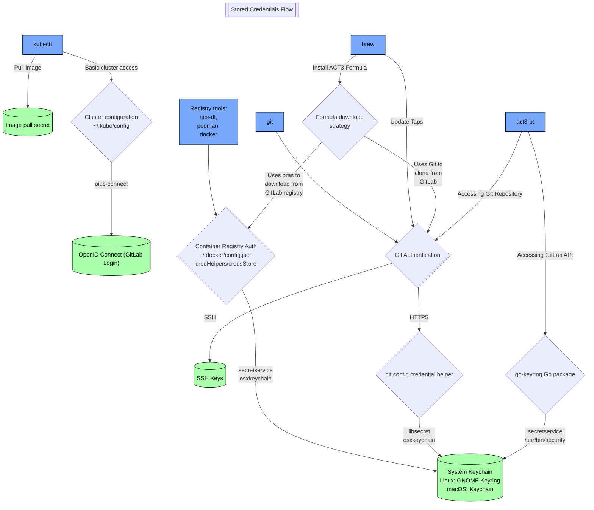

# ACT3 Login Developer Guide

## Components

ACT3 Login is divided into three components:

- A public script that acts as the entrypoint
- A private script that contains all authentication setup and storage
- A public utility script that loads helper functions for output formatting, standard tasks, and system checks

## Execution

The script runs in the following order:

1. The user starts the public script with the one line command in the README.
2. The public script calls the setup script to load helper functions
3. The public script verifies that all system prerequisites are met
4. The public script prompts the user for a GitLab Personal Access Token
5. The token input is verified with GitLab to confirm its existence, scope, and active status
6. The private script is downloaded using the token
7. The public script hands off to the private script
8. The private script calls the setup script to load helper functions
9. The private script executes all authentication setup and storage tasks

## Where Credentials Are Stored

The following graph illustrates how securely stored credentials are surfaced for different tools.

## Development Rules

1. Must be cross platform for Linux and macOS
   - Required platform-specific steps must be executed in conditionals, with a fallback case for "unsupported" systems
2. Do not add prerequisites
   - The only dependencies are:
     - Bash: to execute the script
     - Curl: to download the script, comes preinstalled on supported systems
     - Git: comes preinstalled on supported systems
     - Homebrew: enables cross-platform package management and use of our private Homebrew Tap
   - Any additional dependencies required during the script must be installed during the script using Homebrew
3. Check first
